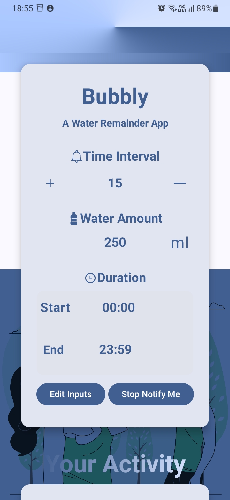

# 🚰 Water Reminder App

A simple and effective water reminder app that allows users to set customized reminders for drinking water and monitor their daily water intake.

## 📝 Project Overview

The **Water Reminder App** helps you stay hydrated by sending customizable reminders throughout the day. You can set the start and end times for notifications and the interval between reminders. The app also tracks your daily water consumption and displays your recent drinking activities.

## App Screenshots Below are some screenshots of the Water Reminder App in action: 

<div align="center"> <table> <tr> <td align="center">  <br /> <strong>Home Screen</strong> </td> <td align="center">  <br /> <strong>Reminder Settings</strong> </td> <td align="center">  <br /> <strong>Activity Tracking</strong> </td> </tr> </table> </div>

## 📋 Requirements

To run this app, ensure the following permissions are granted based on your Android version:

- **Android 13 and above**: The app requires permission to post notifications. This must be allowed for the app to function properly.
- **Android 11 and below**: You need to grant scoped storage permissions to read and write to external storage. The app stores daily logs at the following location in the file manager:  
  `Internal Storage/Documents/water_remainder/daily_list.txt`

## ⚙️ Setup and Installation

### How to Build and Run the Project

1. **Clone the Repository**  
   Open your terminal and run:
```bash
   git clone https://github.com/SaiPavanKiran/water-reminder-app.git
   cd water-reminder-app
```

2. **Open the Project in Android Studio**  
    Launch Android Studio and select `Open an existing project`. Navigate to the cloned directory and open it.
    
3. **Install Dependencies**  
    Make sure you have the necessary SDK versions and dependencies installed. Android Studio will prompt you if anything is missing.
    
4. **Build the Project**
    
    - Go to the `Build` menu and select `Rebuild Project`.
    - Ensure there are no errors in the build process.
5. **Run the Project**
    
    - Connect your Android device via USB or use an emulator.
    - Click on the `Run` button or use `Shift + F10` to run the app on your selected device.

### 🚀 Usage Instructions

1. **Grant Notification Permission**  
    When the app is launched for the first time:
    - For **Android 13 and above**: The app will request permission to send notifications. You need to allow it. If you deny it twice, you will need to enable the permission manually through the device settings.
    - For **Android 10 and below**: The app will request permission to read from external storage to manage logs.

2. **Customize Reminders**  
    On the home page, you will see settings to customize your reminder notifications:
    - Tap on the **Edit Inputs** button to set your preferred start time, end time, and reminder frequency.
    - Tap the **Start Notification Service** button to activate reminders. When starting for the first time, the app will ask you to disable battery optimization for it. This is necessary to ensure the reminders work reliably.
    
3. **View Your Activity**  
    The "Your Activity" section displays your two most recent activities:
    - **Pull up** on the card to view  "see more" button.
    - Tap on **See More** to navigate to the detailed activity screen:
        - On the **right side**, you'll see the amount of water consumed, displayed using a linear progress bar.
        - On the **left side**, you will find individual activity cards.
    - **Top-left corner**: A back button to return to the home screen.
    - **Top-right corner**: A small notice from the developers 😉.

## 🛠️ Troubleshooting

- **App crashes on launch**: Ensure that all dependencies are correctly configured in Android Studio and that your device or emulator meets the app's requirements. Also, check that the necessary permissions are included in the Android manifest.
- **App glitches or crashes occasionally**: This app is not fully optimized, so minor glitches or crashes may occur. However, it should work smoothly in most cases.

**Note**: The app is optimized for **Dark Mode** for a better user experience.

## 🔮 Future Releases

- Further optimization of the app's performance.
- UI enhancements for a more modern and visually appealing interface.
- Addition of a weekly water consumption analysis feature.
- Regular bug fixes and updates.

## 🤝 How to Contribute

We welcome contributions from the community! If you would like to contribute to this project, please follow these steps:

1. **Fork the Repository**  
    Click the `Fork` button at the top right of the repository page to create a copy of the repository under your GitHub account.
    
2. **Create a New Branch**  
    Create a new branch for your feature or bug fix:

```bash
git checkout -b feature-name
```

3. **Make Your Changes**  
    Make your changes to the codebase and ensure that your code follows the project's coding standards.
    
4. **Commit Your Changes**  
    Commit your changes with a descriptive message:

```bash
git commit -m "Add feature name or fix bug"
```

5. **Push Your Changes**  
	Push your changes to your forked repository:

```bash
git push origin feature-name
```

6. **Create a Pull Request**  
	Go to the original repository on GitHub and click on the `Pull Request` button. Provide a description of the changes you have made and submit the pull request for review.

## 📞 Contact Information

For any questions, suggestions, or support, feel free to reach out:

- **Name**: Sai Pavan Kiran
- **GitHub**: [SaiPavanKiran](https://github.com/SaiPavanKiran)


